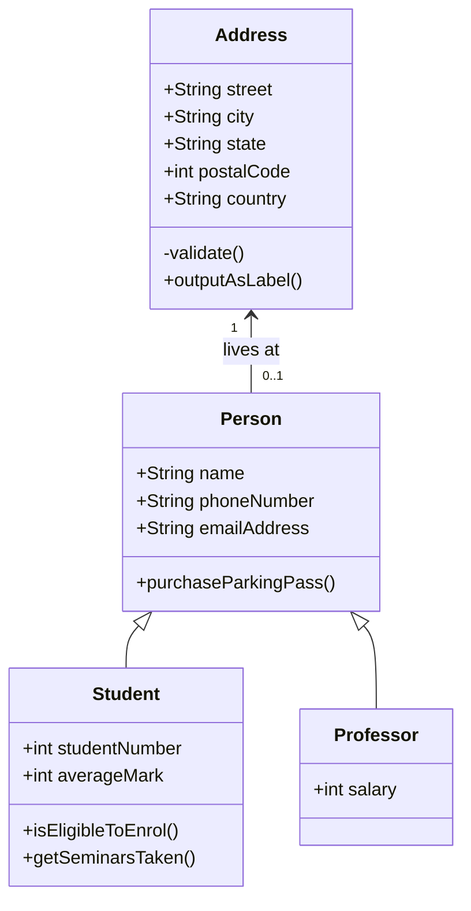

# Welcome to Project Documentation

{: width=160 .center}

This site contains the project documentation for the
`calculator` project that is a toy module used in the
Real Python tutorial

[Document Your Python Project with MkDocs](https://realpython.com/document-your-python-project-with-mkdocs/).
Its aim is to give you a framework to build your
project documentation using Python, MkDocs,
mkdocstrings, and the Material for MkDocs theme.

